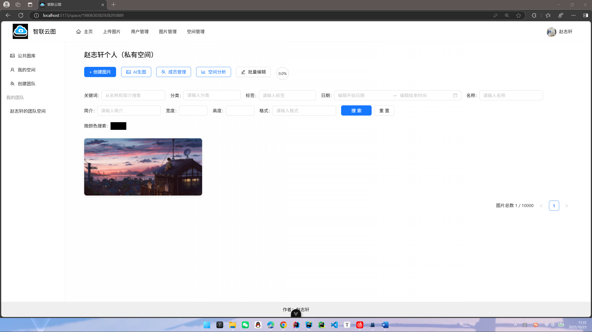
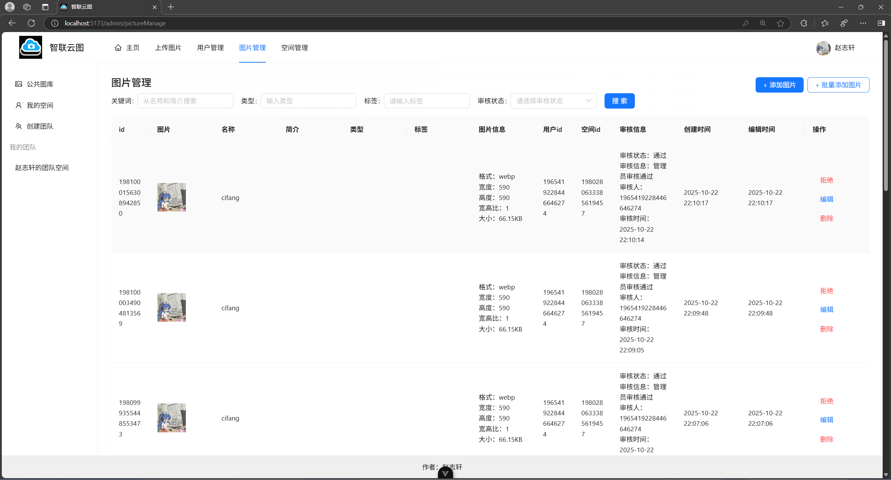
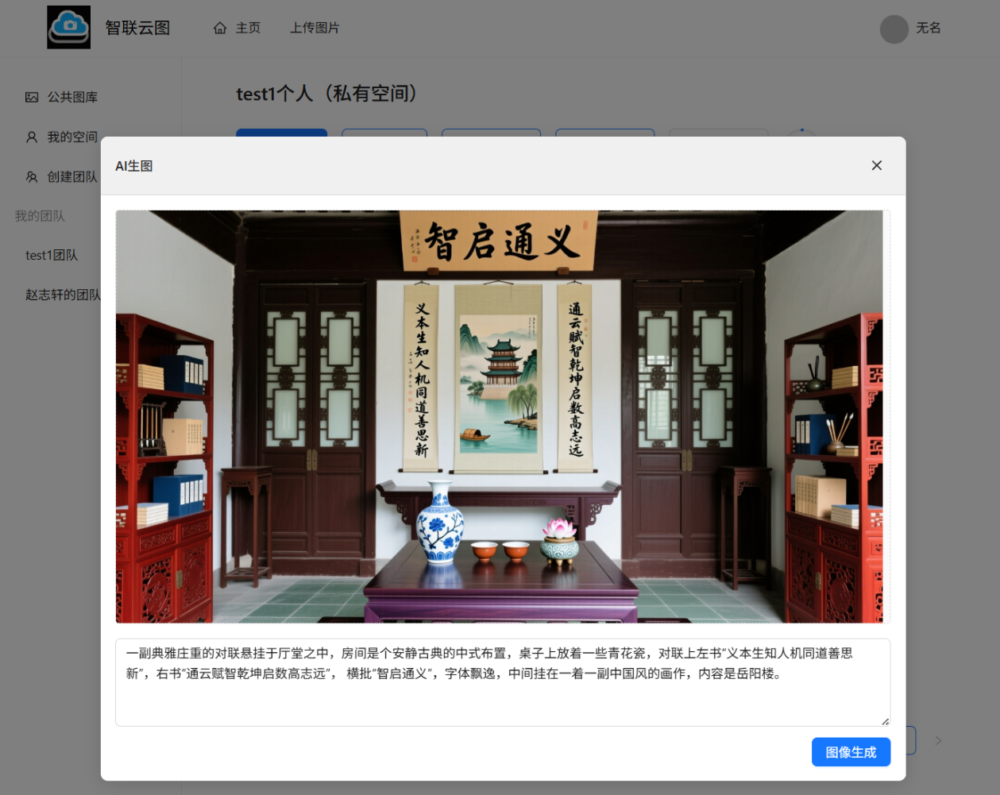
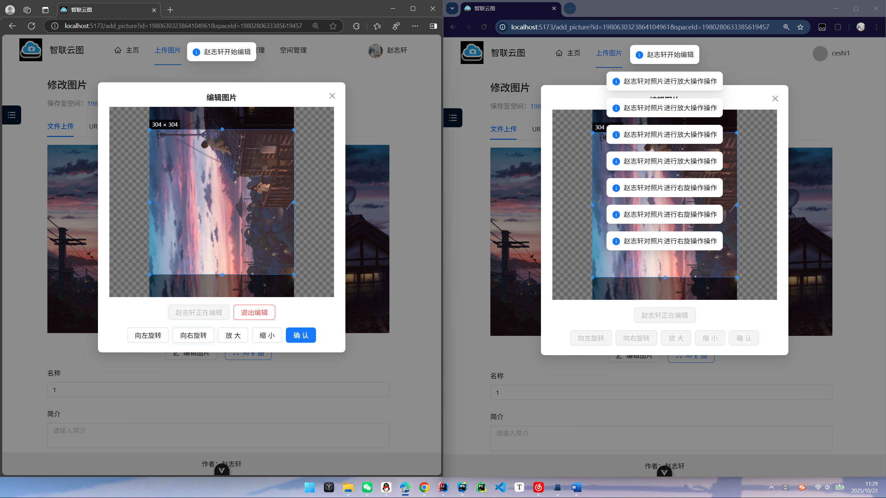

# 智联云图 - 企业级智能协同云图库平台

## 🎯 项目简介

**智联云图** 是一个基于 Spring Boot + Vue3 + MybatisPlus + Redis + AI + COS + WebSocket 构建的企业级智能协同云图库平台，致力于为个人用户、企业和团队提供高效、智能的图片管理与协作解决方案。

## 🔧 技术栈

- 后端框架：Spring Boot + MybatisPlus
- 前端框架：Vue3
- 缓存中间件：MySQL + Redis
- 文件存储：COS (Cloud Object Storage)
- 实时通信：WebSocket
- AI扩图：扩图模型
- AI文生图：文生图模型

## 🌟 核心功能

### 👥 用户角色体系

1. **普通用户**
   - 公开图片上传与检索
   - 个人网盘/相册管理
   - 图片下载、分享、编辑、查看相似图片
   - 文生图功能
   - AI扩图功能
   - 个人信息管理

2. **管理员**
   - 图片审核与管理
   - 系统图片数据分析
   - 用户权限管理

3. **企业用户**
   - 团队空间创建与管理
   - 成员邀请与权限分配
   - 实时协同编辑图片

### ⚡ 性能优化

- **Redis缓存策略**
  - 热点图片缓存
  - 用户登录信息缓存
- **shardingSphere分片**
  - 对特定用户的图片进行分片存储，避免单表数据量过大，优化查询性能

## 🏗️ 应用场景

- 壁纸网站/素材网站
- 个人网盘/相册/作品集
- 企业活动相册
- 企业内部素材库
- 团队协作项目管理

## 📈 项目亮点

- 多角色权限控制系统
- 实时协同编辑功能
- AI文生图能力
- 智能缓存优化机制
- 可视化数据统计

